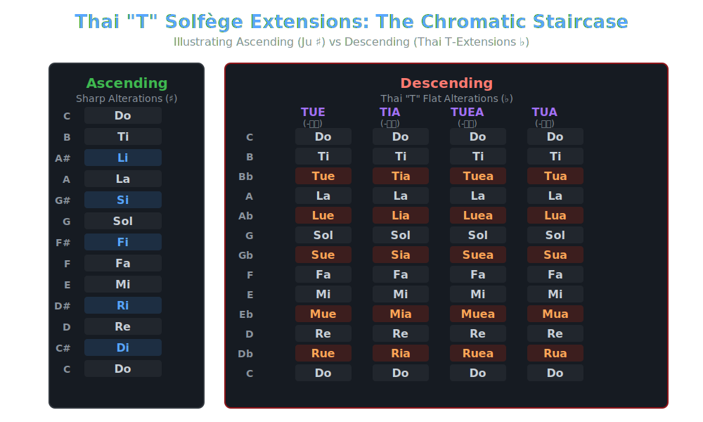

# Ju Solfège: Thai "T" Extensions 🇹🇭
**(Academic Case Study & Phonetic Extension for Singing Voice Synthesis)**

---

## 🌎 ENGLISH: COPYRIGHT & TERMS OF USE DECLARATION

**Inventor & Copyright Holder:** Paisan Chamnong (JiewJumnong)  
**Year of Publication:** 2026  
**Intellectual Property Type:** Music Theory System & Phonetic Algorithm for AI/SVS

This alternative phonetic system, **"Ju Solfège: Thai 'T' Extensions"** (comprising the flat systems: TUE, TIA, TUEA, TUA), was invented as an official extension to the original Ju Solfège framework. Its primary objective is to enhance the sustained vowel performance (formant resonance and diphthong elongation) of AI Singing Voice Synthesis (SVS) engines by adapting the phonetic characteristics of Thai long vowels.

The inventor (Paisan Chamnong / JiewJumnong) grants the public, software developers, and educational institutions the right to use this system **for free (Open Source)** under the following conditions:

1. **Attribution Requirement:**
   Any software, application, AI engine, or academic publication that utilizes these specific long-vowel flat mappings (`Tue, Tia, Tuea, Tua`) **MUST explicitly credit the inventor "Paisan Chamnong (JiewJumnong)" and reference "Ju Solfège Thai Extensions"** in the documentation, credits page, or bibliography.
   
2. **Commercial Use:**
   This system may be legally embedded into commercial music software (e.g., Commercial VSTs, SVS, Vocaloid plugins) completely **Royalty-Free**, provided that the Attribution Requirement (Rule 1) is strictly followed.
   
3. **No Core Modification for Official Claim:**
   To prevent academic confusion, any system claiming to implement the "Ju Solfège Thai Extensions" must faithfully retain the exact vowel transformation logic for the Chromatic Flat notes (Db, Eb, Gb, Ab, Bb) as established by the inventor.

---

## 🇹🇭 THAI: ประกาศลิขสิทธิ์และเงื่อนไขการนำไปใช้งาน

ระบบสัทศาสตร์ทางเลือกชุดนี้ **"Ju Solfège: Thai 'T' Extensions"** (ประกอบด้วยระบบแฟลต: TUE, TIA, TUEA, TUA) ถูกคิดค้นขึ้นเพื่อเป็นส่วนต่อขยาย (Extension) จากระบบ Ju Solfège ดั้งเดิม โดยมีจุดประสงค์หลักเพื่อพัฒนาประสิทธิภาพการลากสระเสียงยาว (Long Vowels / Diphthongs) ของปัญญาประดิษฐ์สังเคราะห์เสียงร้อง (AI Singing Voice Synthesis) ให้มีความกังวานแบบสัทศาสตร์ภาษาไทย

ผู้คิดค้น (นาย ไพศาล จำนง ( จิ๋ว จำนง ) / JiewJumnong) อนุญาตให้สาธารณชน นักพัฒนาซอฟต์แวร์ และสถาบันการศึกษา **สามารถนำระบบนี้ไปใช้งานได้ฟรี (Free to use)** ภายใต้เงื่อนไขดังต่อไปนี้:

1. **การให้เครดิต (Attribution):**
   ผู้ที่นำระบบแฟลตสระเสียงยาวนี้ (Tue, Tia, Tuea, Tua) ไปใช้งานในซอฟต์แวร์, แอปพลิเคชัน, AI Engine หรือใช้ในการตีพิมพ์งานวิจัย **จะต้องระบุชื่อผู้คิดค้น "Paisan Chamnong (JiewJumnong)" ร่วมกับชื่อระบบ "Ju Solfège Thai Extensions"** ไว้ในคู่มือ, หน้า Credits หรือแหล่งอ้างอิงของผลงานนั้นๆ อย่างชัดเจน
   
2. **การใช้งานเชิงพาณิชย์ (Commercial Use):**
   อนุญาตให้นำไปฝัง (Embed) เป็นชุดคำสั่งในซอฟต์แวร์ดนตรีเชิงพาณิชย์ (Commercial VST, SVS, Vocaloid, etc.) ได้โดยไม่มีค่าลิขสิทธิ์ (Royalty-Free) ตราบใดที่ปฏิบัติตามกฎการให้เครดิตในข้อที่ 1
   
3. **ห้ามดัดแปลงแก่นทฤษฎี (No Core Modification for Official Claim):**
   หากมีการนำระบบนี้ไปอ้างอิงในชื่อ "Ju Solfège Thai Extensions" จะต้องคงหลักการผันสระของโน้ต Chromatic Flat (Db, Eb, Gb, Ab, Bb) ตามที่ผู้คิดค้นกำหนดไว้โดยห้ามบิดเบือน เพื่อป้องกันความสับสนทางวิชาการ

---

## 🎹 System Structure & The "Staircase" Concept

The **"T"** stands for **Thailand**. It honors the origin of the phonetic vowel shapes utilized in this extension. By replacing the standard Ju Solfège flat vowel (`-u`) with wider Thai diphthongs and long vowels, the AI's vocal tract simulation avoids the "rounded-lip formant drop" that occurs during prolonged notes.

### Ascending vs. Descending (ขาขึ้น และ ขาลง)

The Staircase Concept defines how the syllables adapt based on chromatic direction:
* **Ascending (ขาขึ้น / Sharps ♯):** Replace the diatonic vowel with **`i`** (Di, Ri, Fi, Si, Li).
* **Descending (ขาลง / Flats ♭):** The Thai extensions replace the traditional **`u`** vowel with four rich resonant alternatives:

| Note (♭) | Base (Diatonic) | 1. TUE (-ือ) | 2. TIA (-ีย) | 3. TUEA (-ือ) | 4. TUA (-ัว) |
|:---:|:---:|:---:|:---:|:---:|:---:|
| **Db** | Re | Rue | Ria | Ruea | Rua |
| **Eb** | Mi | Mue | Mia | Muea | Mua |
| **Gb** | Sol| Sue | Sia | Suea | Sua |
| **Ab** | La | Lue | Lia | Luea | Lua |
| **Bb** | Ti | Tue | Tia | Tuea | Tua |

---

## 📊 Comprehensive 12-Tone Comparison Table

The following master table demonstrates how the Thai "T" Extensions integrate into the global Ju Solfège standard (Ascending vs Descending), compared alongside the American and British systems.

| Note | Ju ♯ | Ju ♭ | TUE | TIA | TUEA | TUA | American | British |
|------|------|------|-----|-----|------|-----|----------|---------|
| C  | Do  | Do  | Do  | Do  | Do   | Do  | Do  | Doh |
| C# | **Di** | —   | —   | —   | —    | —   | Di  | Di  |
| Db | —   | **Ru** | **Rue** | **Ria** | **Ruea** | **Rua** | Ra  | Raw |
| D  | Re  | Re  | Re  | Re  | Re   | Re  | Re  | Ray |
| D# | **Ri** | —   | —   | —   | —    | —   | Ri  | Ri  |
| Eb | —   | **Mu** | **Mue** | **Mia** | **Muea** | **Mua** | Me  | Maw |
| E  | Mi  | Mi  | Mi  | Mi  | Mi   | Mi  | Mi  | Me  |
| F  | Fa  | Fa  | Fa  | Fa  | Fa   | Fa  | Fa  | Fah |
| F# | **Fi** | —   | —   | —   | —    | —   | Fi  | Fi  |
| Gb | —   | **Su** | **Sue** | **Sia** | **Suea** | **Sua** | Se  | Saw |
| G  | Sol | Sol | Sol | Sol | Sol  | Sol | Sol | Soh |
| G# | **Si** | —   | —   | —   | —    | —   | Si  | Si  |
| Ab | —   | **Lu** | **Lue** | **Lia** | **Luea** | **Lua** | Le  | Law |
| A  | La  | La  | La  | La  | La   | La  | La  | Lah |
| A# | **Li** | —   | —   | —   | —    | —   | Li  | Li  |
| Bb | —   | **Tu** | **Tue** | **Tia** | **Tuea** | **Tua** | Te  | Taw |
| B  | Ti  | Ti  | Ti  | Ti  | Ti   | Ti  | Ti  | Ti  |

---

*Signed digitally by / ลงนาม:*
**Paisan Chamnong (JiewJumnong)**
*Core Developer & Music Theorist*
